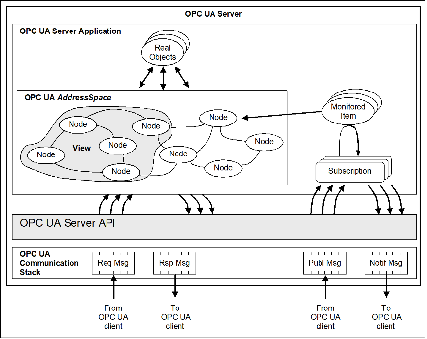
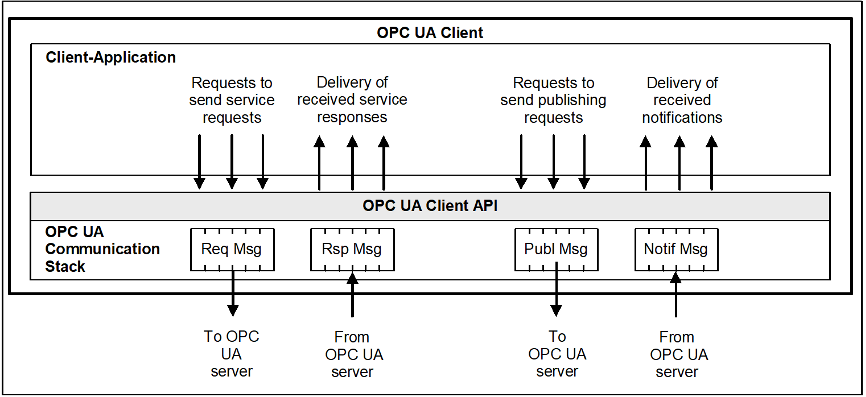
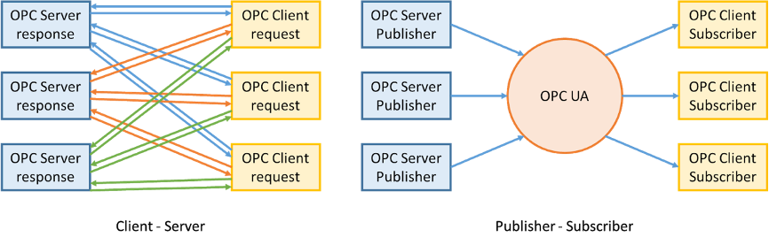
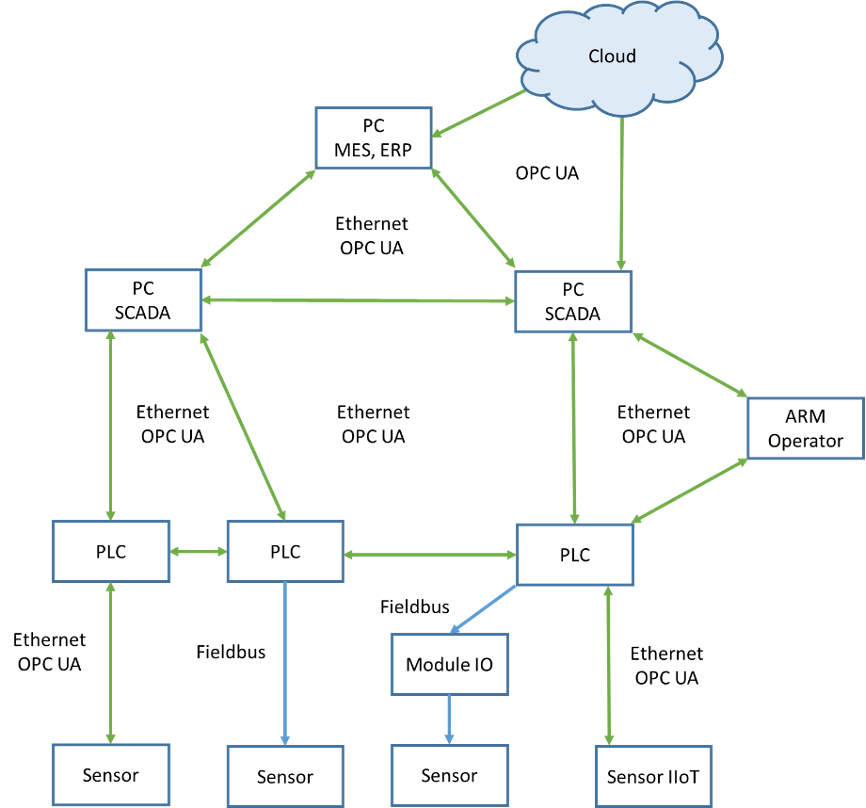

# OPC DA 和 OPC UA 的标准介绍
OPC（Open Platform Communications，以前称为 OLE for Process Control）是一组软件技术，为控制各种设备和交换数据提供单一、统一的接口。OPC 规范由国际非营利组织 OPC 基金会制定，该组织于 1994 年由领先的工业自动化产品制造商制定。创建 OPC 的目标是为工程师提供一个通用接口来控制各种设备。

通过实现对 OPC 客户端的支持，SCADA 系统开发人员摆脱了为各种设备支持数百个驱动程序的需要，设备制造商通过添加 OPC 服务器，确信他们的产品可以被任何 SCADA 系统的用户使用。

OPC 技术包括多个标准，这些标准描述了用于特定目的的一组功能。现行标准：

    •   OPC DA（数据访问）是最常见的标准，它描述了一组与 PLC、DCS、HMI、CNC 和其他设备进行实时数据交换的功能。
    •	OPC HDA（历史数据访问）提供对已保存数据和历史的访问。
    •	OPC AE（警报和事件）为各种事件提供按需通知功能：紧急情况、操作员操作、信息消息等。
    •	OPC Batch提供工艺过程的步骤和配方控制功能。
    •	OPC DX (Data eXchange)提供通过以太网在 OPC 服务器之间组织数据交换的功能。该标准的主要目的是为来自不同制造商的设备和程序之间的数据交换创建网关。
    •	OPC 安全定义了组织客户端对 OPC 服务器数据的访问权限的功能。
    •	OPC XML-DA（XML 数据访问）提供了一种灵活的、规则驱动的格式，用于通过 XML、SOAP 和 HTTP 交换数据。
    •	OPC 复杂数据是一组针对 OPC DA 和 XML-DA 的附加规范，允许服务器处理复杂数据类型，例如二进制结构和 XML 文档。
    •	OPC 命令是一组编程接口，允许 OPC 客户端和服务器识别、发送和控制在控制器或 I/O 模块中执行的命令。
    •	OPC UA（统一架构）是不基于 Microsoft COM 技术的最新规范，它提供了跨平台兼容性。
最普遍的标准是 OPC DA，但它有一个明显的缺点。在其发展时，它建立在当时的现代 Windows 技术之上：OLE、ActiveX、COM/DCOM，但此后行业发生了变化，其他操作系统和技术也开始流行。因此，使 OPC 技术独立于平台，并在开放的跨平台技术上开发了 OPC UA（统一架构）标准。

## 使用 OPC 的地方
通常，OPC 技术用于在控制器和 SCADA 系统之间交换数据，但也可以在过程控制系统的不同级别组织复杂的系统。
OPC 由两部分组成：OPC 客户端和 OPC 服务器。OPC 服务器软件通过现场总线通过设备驱动程序轮询各种设备。OPC 客户端软件通常内置于 SCADA 系统中，旨在从 OPC 服务器接收数据。

在这里，我们可以将公司中的 ACS 的几个级别可视化：

    •	较低的级别是现场总线和单独的控制器
    •	中间层是店铺网络
    •	APCS 级别是 SCADA 类型系统的操作级别
    •	MICS级别是企业资源管理应用、ERP、MES的级别
这些层中的每一层都可以由 OPC 服务器提供服务，将数据提供给更高层的 OPC 客户端或相邻设备。

## OPC DA 服务器的工作原理
OPC DA 服务器在客户端程序（通常是 SCADA 系统）和终端设备之间提供数据交换（写入和读取）。OPC 中的数据是具有某些属性的标签变量。变量可以是 OLE 中允许的任何类型：各种整数和实数类型、布尔值、字符串、日期、数组等。属性可以是必需的、推荐的或自定义的。

必需的变量属性：

    •	变量的当前值、它的类型和访问权限（读和/或写）。
    •	变量的质量取决于超出动态范围的测量值、数据缺失、通信错误和其他参数。通常采用值：好/坏/不确定和附加信息。
    •	该时间戳报告时可变收到的给定值的时间。
    •	OPC 服务器轮询变量的频率设置了更新变量值的时间。
    •	变量描述，其中包含有关此变量是什么的用户信息。

此外，可以指定可选属性，例如：值变化范围、测量单位和其他自定义参数。

可以使用多种模式从 OPC 服务器读取数据：

    •	同步模式：客户端向服务器发送请求并等待它的响应。
    •	异步模式：客户端发送请求并立即继续执行其他任务。处理完请求后，服务器向客户端发送通知，客户端获取提供的数据。
    •	订阅模式：服务器只向客户端发送发生变化的标签。为了防止数据的噪声被误认为它们的变化，引入了“死区”的概念，它稍微超过了干扰的最大可能幅度。
    •	数据刷新模式：客户端调用所有活动标签的同时读取。除了那些被指定为“被动”的标签外，所有标签都被称为主动标签。标签的这种划分通过更新从物理设备接收到的数据来减少处理器的负载。
客户端从缓冲区或直接从终端设备接收来自 OPC 服务器的数据。从缓冲区读取速度更快，但其中的数据在读取时可能已过期。OPC 服务器通过从终端设备请求信息来定期更新数据。
数据以同步或异步模式写入终端设备，无需中间缓冲。在同步模式下，客户端写入数据并等待，直到收到终端设备对命令执行的确认。此过程可能需要很长时间，在此期间客户端正在等待。异步模式允许客户端向服务器发送请求并执行其他任务。录制结束后，服务器会向客户端发送通知。

## OPC UA 标准
OPC UA（统一架构）是工业网络中数据传输的现代标准。它提供设备之间安全可靠的通信，同时独立于硬件和平台，允许不同操作系统的设备之间进行通信。

OPC UA 的优势在于面向对象的信息模型，它允许“查看”数据（以 Web 浏览器样式）和面向服务的架构 (SOA)。如果之前您必须使用多个 OPC 服务器：用于实时数据的 OPC DA、用于历史的 OPC HDA 和用于事件的 OPC AE，现在所有这些以及更多功能都可以在一个 OPC UA 标准中使用。现在引入了节点或对象的概念，而不是标签树。每个节点包括一个真实对象的变量、方法和其他数据结构。

数据交换现在通过二进制结构和 XML 文档进行。除了客户端/服务器模型，发布者/订阅者模型变得可用。该标准还定义了一种机制来支持冗余（如果一个客户端变得不可用，那么另一个客户端会取代它）并在发生故障时快速恢复通信。数据传输通过传输层 TCP、HTTP/SOAP 或 HTTPS 进行。OPC UA 支持数字证书和加密传输数据的能力，而不是 Windows 访问控制机制。

通过特殊的包装器和代理模块实现了与 OPC DA 的向后兼容性。为了通过路由器和防火墙传输数据，OPC DA 需要使用中间件，而 OPC UA 在没有这种介质的情况下工作。OPC UA 规范包括几个部分，描述了服务器和客户端的操作逻辑。IEC 62541 标准中提供了该规范的详细版本。

## 使用 OPC 的缺点
使用 OPC 时的常见错误包括：

    •	过度依赖 OPC 技术
    •	在 APCS 中不必要地使用 WEB 技术
    •	在远程机械任务中使用实时协议
假设您已经了解了良好的 OPC 技术，并且正在努力仅用 OPC 替换所有低层协议。但是将 Modbus、Profibus 和任何其他工业协议转换为 PC 格式将需要额外的时间并浪费计算能力。测试表明，SCADA 系统直接使用工业协议的速度比通过中间 OPC 服务器快两倍。当然，有些系统不需要实时监控过程，但是在设计自动化过程控制系统时必须考虑到这一点。

缺点还包括设置 OPC 服务器的复杂性以及需要手动输入数千个标签。此外，OPC 服务器并不总是免费提供的，大多数情况下您必须为每台 PC 购买单独的许可证。

如果系统通过互联网将数据发送到云端，那么弱加密方案就可能成为潜在的漏洞和黑客攻击的目标，从而对整个ICS的安全性产生怀疑。

## 用于实时操作的 OPC UA
OPC UA over TSN旨在支持实时操作，这种 OPC UA 技术可以结合 TSN（时间敏感网络）技术使用发布者/订阅者模型（而不是客户端/服务器模型）。

客户端/服务器模型在点对点连接的情况下工作正常，但如果有很多设备，则数据更新会出现延迟。发布者/订阅者模型提供了一对多和多对多的关系。服务器将其数据发送到网络（发布），每个客户端都可以接收此数据（订阅）。

采用 TSN 技术的以太网在服务质量 (QoS) 方面补充了现有的以太网设施，包括带宽分配、定时、低延迟保证和冗余。数据由各种设备通过以太网以流的形式传输。带有 TSN 的以太网交换机允许您为每个流分配自己的带宽并确保其实时传输。多个流可以组合（称为网络融合）并通过同一网络实时发送。事实证明，如果没有 TSN 技术，一个以太网网络只能传输一种实时协议，而使用 TSN 则可以传输多种实时协议。

OPC UA over TSN 技术的组合允许组织不同制造商生产的设备之间的通信，并确保实时连续接收数据。

OPC 基金会计划使用 OPC UA 不仅在控制器和 SCADA 系统之间传输数据，而且在现场级别从传感器和物联网设备到控制器，以及从云中的本地系统传输数据。为此，他们计划将 OPC UA 标准分为 4 个部分，具体取决于设备的性能及其所需的功能。

    •	Nano Embedded Device Server：适用于最小的传感器
    •	微型嵌入式设备服务器：适用于廉价的 PLC
    •	嵌入式UA Server：适用于更强大的PLC和边界网关
    •	标准 UA 服务器：支持所有功能的成熟实现

## OPC UA 观点
可以肯定地说，尽管 OPC DA 标准仍在广泛使用，但它已不再满足现代自动化要求。它基于遗留技术，难以配置，不符合现代安全标准。它被现代 OPC UA 标准所取代，具有加密数据和构建从传感器到云的统一数据传输系统的能力。OPC UA 与 TSN 的联合使用显着扩展了实时数据传输技术的能力。

